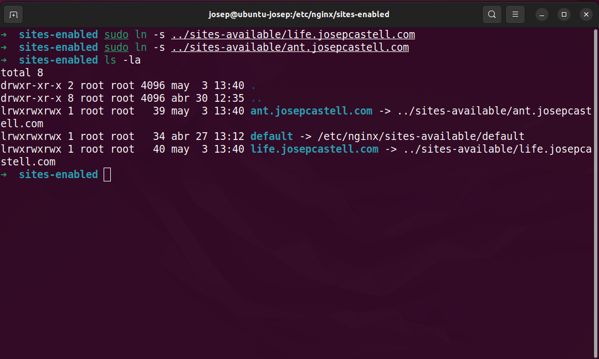

# Instalación y configuración del servidor web Nginx: Virtual Hosts

## Sistemas Informáticos - DAW1

### Josep Maria Castell Colom

<hr/>

### Introducción

**Nginx** es un _servidor web/proxy inverso_ ligero de alto rendimiento y un proxy para protocolos de correo electrónico (IMAP/POP3).

Es software libre y de código abierto, licenciado bajo la _Licencia BSD simplificada_ [...]. Es multiplataforma, por lo que corre en sistemas tipo _Unix_ (_GNU/Linux_, _BSD_, _Solaris_, _Mac OS X_, etc.) y _Windows_.

El sistema es usado por una larga lista de sitios web conocidos, como: _WordPress_, _Netflix_, _Hulu_, _GitHub_, _Ohloh_, _SourceForge_, _TorrentReactor_ y partes de _Facebook_ (como el servidor de descarga de ardchivos zip pesados). [¹]

Esta práctica consiste en configurar dos _virtual hosts_ con diferente subdominio en un mismo servidor _Nginx_.

### Instalación

> Debido a que usaremos una máquina con distribución Ubuntu, todas las explicaciones estarán destinadas a dicho sistema.

Para instalar el servidor _Nginx_ en una máquina Ubuntu debemos abrir una nueva terminal e introducir el ya clásico `sudo apt update` para actualizar la lista de paquetes y a continuación:

```
sudo apt install nginx
```

<div style="width:100%;text-align:center">

</div>

Con ello se descargará la paquetería necesaria y se crearan una serie de directorios con la configuración del servidor.

Para comprobar si la descarga e instalación han sido satisfactorias vamos a abrir una ventana de nuestro navegador e introduciremos `localhost` en la barra de direcciones.

Si nos aparece la siguiente página de bienvenida significa que ha funcionado a la perfección:

<div style="width:100%;text-align:center">

</div>

### Entendiendo el funcionamiento de Nginx

En este punto es interesante observar cómo funciona Nginx. Para ello observemos el directorio de configuración de Nginx situado en la ruta `/etc/nginx/`.

<div style="width:100%;text-align:center">

</div>

Aquí vemos dos directorios interesantes: _sites-available_ y _sites-enabled_.  
En el primero guardaremos los sitios disponibles y, en el segundo directorio, los sitios activados.  
En el primero se encuentra un archivo de configuración del servidor llamado _default_ y en el segundo directorio hay un enlace simbólico que apunta al anterior (`/etc/nginx/sites-available/default`).

<div style="width:100%;text-align:center">

</div>

Si abrimos este archivo vemos una serie de parámetros de configuración de los cuales nos interesan:

- **listen**: el puerto al que escucha; en este caso el _80_.
- **root**: el directorio raíz de la página; en este caso `/var/www/html`.
- **server_name**: el nombre del servidor; en este caso \_.

<div style="width:100%;text-align:center">

</div>

Si nos dirigimos a la ruta especificada como raíz (`/var/www/html`) encontramos un único archivo en formato _html_ de nombre _index.nginx-debian.html_. Si lo abrimos vemos la estructura de un documento html con el contenido de la página visitada en _localhost_.

<div style="width:100%;text-align:center">

</div>

### Creación de dos páginas web

Debido a que el objetivo de esta práctica es el de albergar dos páginas web con diferentes subdominios en el mismo servidor, debemos crear estas dos páginas. Para ello vamos a cojer prestados dos pequeños juegos de la página [One HTML Page Challenge](https://onehtmlpagechallenge.com/) ya que contienen todo el código en un mismo archivo _.html_.  
En nuestro caso hemos elegido los juegos [_Game of Life_](https://onehtmlpagechallenge.com/entries/game_of_life.html) y [_Ant Colony_](https://onehtmlpagechallenge.com/entries/ant_colony.html).

Estos archivos debemos guardarlos cada uno en una carpeta diferente dentro del directorio `/var/www` con nombre _index.html_ y con el contenido del código fuente de cada uno de los juegos elegidos.

<div style="width:100%;text-align:center">

</div>

### Configuración de los subdominios

El siguiente paso es dirigirnos al directorio `/etc/nginx/sites-available` y copiar el archivo de configuración default para cada uno de nuestros nuevos sitios web, usaremos de nombre la direccion completa _subdominio.dominio.com_.

<div style="width:100%;text-align:center">

</div>

A continuación debemos editar cada uno de los ficheros para que se correspondan con su dirección. Para ello modificaremos el contenido del archivo de configuración cambiando los parámetros mencionados anteriormente:

- **listen**: dejaremos el mismo puerto (80) aunque eliminaremos la opción _defalut_server_ ya que sólo podemos tener un servidor por defecto.
- **root**: actualizaremos el directorio raíz para cada uno de los dos juegos con la ruta de la carpeta donde los hemos guardado.
- **server_name**: aquí vamos a definir el nombre de la dirección que nos redirigirá a nuestra página.

<div style="width:100%;text-align:center">

</div>

<div style="width:100%;text-align:center">

</div>

Una vez hecho esto debemos añadir los archivos de configuración a la carpeta _sites-enabled_ pues por ahora estan disponibles pero no activados.

Para hacer esto nos dirigiremos a la carpeta destino (`/etc/nginx/sites-enabled`) e introduciremos el comando `ln -s <dirección_archivo_origen>` para crear un enlace (`ln`) simbólico (`-s`).

<div style="width:100%;text-align:center">

</div>

El último paso es modificar el archivo `/etc/hosts` el cual informará al navegador de que debe buscar las URLs mencionadas en nuestra propia IP.

Para ello nos dirigimos al archivo mencionado y añadimos en la dirección `127.0.1.1` las dos direcciones que hemos establecido para nuestras páginas.

<div style="width:100%;text-align:center">

</div>

Y para que todos estos cambios tengan efecto debemos reiniciar el servidor Nginx con el comando `nginx -s reload`.

### Comprobación

Si ahora vamos a nuestro navegador e introducimos las URLs definidas accederemos a cada una de las páginas creadas.

<div style="width:100%;text-align:center">

</div>

<div style="width:100%;text-align:center">

</div>

Y si introducimos simplemente `localhost` seguimos visitando la página de bienvenida de Nginx ya que es la que hemos dejado por defecto.

<div style="width:100%;text-align:center">

</div>

### Bibliografia

[¹]. https://es.wikipedia.org/wiki/Nginx
